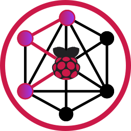

# PyRPIO



A Python 3 addon which provides high-speed access to the Raspberry Pi GPIO interface, supporting regular GPIO as well as i²c, PWM, SPI, and MDIO.

This package is inspired by [node-rpio](https://github.com/jperkin/node-rpio) which is a node.js addon.


## Compatibility

- Raspberry Pi Models: A, B (revisions 1.0 and 2.0), A+, B+, 2, 3, 3+, 3 A+, 4, Compute Module 3, Zero.
- Python 3.6+

## Install

Install the latest from PyPi:

> `pip install pyrpio`

## Supported Interfaces

- GPIO
- PWM
- I2C
- MDIO
- SPI

## Examples

```python
from pyrpio import i2c, mdio

### I2C Operations ###

i2c_bus = i2c.I2C('/dev/i2c-3')
i2c_bus.open()

i2c_bus.set_address(0x50)

# Read 8-bit value using 8-bit addressing
val = i2c_bus.read_register(0x0)
i2c_bus.set_address(0x21)

# Read uint16_t using 8-bit addressing
val = i2c_bus.read_register(0x0, reg_nbytes=1, val_nbytes=2)

# Read int16_t using 8-bit addressing
val = i2c_bus.read_register(0x0, reg_nbytes=1, val_nbytes=2, signed=True)

# Seq read 8 regs starting @ 0x0 using I2C repeat start
regs = i2c_bus.read_register_sequential(0,8)

# Close up shop
i2c_bus.close()

### MDIO Operations ###

# Create bus using GPIO pins 23 and 24 (bit-bang)
mdio_bus = mdio.MDIO(clk_pin=23, data_pin=24, path='/dev/gpiochip0')
mdio_bus.open()

# Read register 0x10 from device 0x30 (CLAUSE-45)
mdio_bus.read_c45_register(0x30, 0x00, 0x10)

# Read register set from device 0x30 (CLAUSE-45)
mdio_bus.read_c45_registers(0x30, 0x00, [0,1,2,3,4])

# Close up shop
mdio_bus.close()
```

## License

This project is licensed under the MIT License - see the [LICENSE.md](LICENSE.md) file for details

## Maintainers

- [Samtec - ASH](https://samtec-ash.com)
